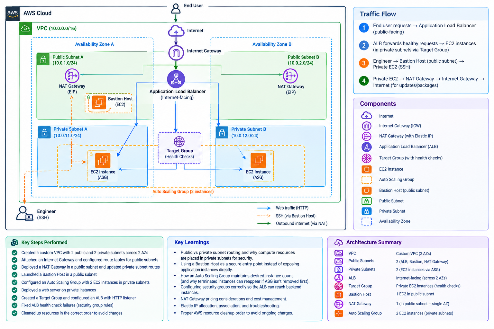

# Highly-Available-Web-Application

Designed and deployed a highly available, secure web application architecture on AWS using a custom VPC, Auto Scaling, a Bastion Host, and an Application Load Balancer — following AWS best practices for placing compute resources in private subnets while still allowing controlled access and public reachability.

## 📌 Problem Statement

A basic web app running on a single EC2 instance in a public subnet has three failure points: no redundancy if that instance or its AZ goes down, no isolation between public-facing and internal resources, and no way to handle traffic spikes.

## 🏗️ How This Architecture Solves It

- **Availability** → Multi-AZ Auto Scaling Group with 2+ EC2 instances behind an ALB. If one instance or AZ fails, the ALB routes around it and the ASG maintains the minimum healthy instance count.
- **Security** → EC2 instances live in private subnets with no public IP. The only way in is through a Bastion Host (SSH) or the ALB (HTTP) — nothing else is reachable from the internet.
- **Scalability** → The ALB distributes load evenly across instances, and the ASG scales out to handle increased traffic.

  **## 🧰 Tech Stack

AWS VPC · EC2 · Auto Scaling Group · Application Load Balancer · NAT Gateway · Bastion Host · IAM

## ✅ Key Steps Performed

- Created a custom VPC with 2 public and 2 private subnets across 2 Availability Zones
- Attached an Internet Gateway and configured route tables for public subnets
- Deployed a NAT Gateway in a public subnet and updated private subnet routes
- Launched a Bastion Host in a public subnet for secure SSH access
- Configured an Auto Scaling Group with EC2 instances in private subnets
- Deployed a web server on the private instances
- Created a Target Group and configured an ALB with an HTTP listener
- Debugged and fixed ALB health check failures caused by security group rules
- Verified traffic distribution across instances and cleaned up all resources afterward

## 📚 Key Learnings

- Public vs. private subnet routing and why compute resources belong in private subnets for security
- Using a Bastion Host as a secure entry point instead of exposing application instances directly
- How an Auto Scaling Group maintains desired instance count
- Configuring security groups correctly so the ALB can reach backend instances
- NAT Gateway pricing considerations and cost management
- Proper AWS resource cleanup order to avoid ongoing charges
